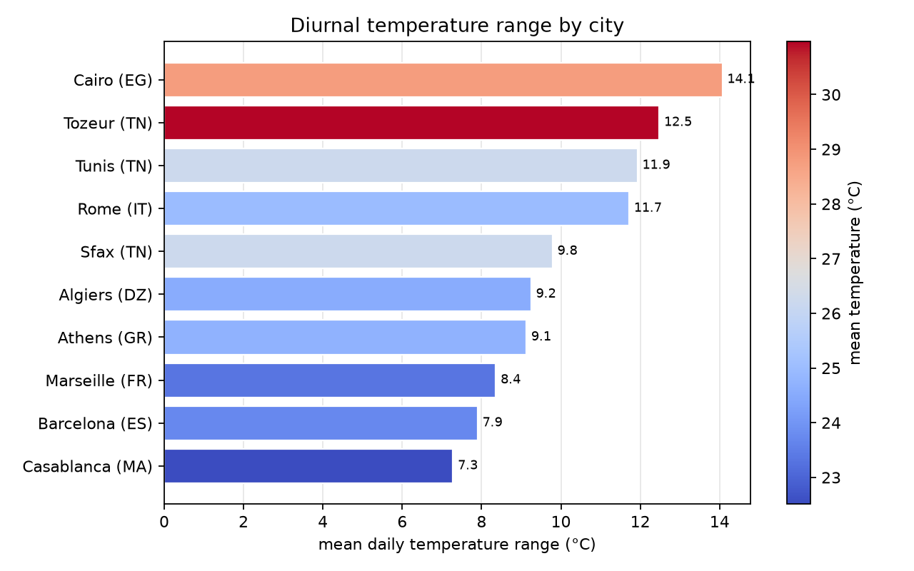

# daily-climate-pipeline

[](https://github.com/EyaAzzabi/daily-climate-pipeline/actions/workflows/ingest.yml)
[](https://github.com/EyaAzzabi/daily-climate-pipeline/actions/workflows/ci.yml)
[](LICENSE)
[](pyproject.toml)
[](tests/)
[](#running-it)

A scheduled data pipeline that ingests daily climate observations for ten
Mediterranean and North African cities, **validates them before they reach the
warehouse**, and rebuilds its own charts and status page on every run.

Runs every morning on GitHub Actions. The run history in this repository is the
point: a pipeline that ran once is a script, a pipeline that has run every day
since April is infrastructure.



---

## The idea

Most portfolio data projects load a CSV once inside a notebook. The interesting
problems in data engineering only appear on the second run:

- What happens when the same day is ingested twice?
- What happens when one source of ten fails?
- What happens when the source starts returning nulls, or changes a unit?
- How would you even find out?

This pipeline is built around those four questions rather than around the data.

---

## Architecture

```
Open-Meteo archive API
        │  retry with exponential backoff, one request per city
        ▼
  bronze/  ── raw JSONL, written before anything transforms it
        │
        ▼
  quality gate  ── 14 checks; blocking checks stop the load
        │                    ├── pass ──► load
        │                    └── fail ──► warehouse untouched, run logged red
        ▼
  DuckDB warehouse
        ├── dim_city             star-schema dimension
        ├── fact_daily_weather   PK (city_id, observed_date)
        └── run_log              every run, successful or not
        │
        ▼
  gold_monthly_city · gold_city_summary   rebuilt each run
        │
        ├──► data/fact_daily_weather.csv   the committed record (48 KB)
        ▼
  reports/  ── charts and status.md regenerated, committed by CI
```

**What is committed, and what is not.** The DuckDB file is a *build artifact* and is
gitignored. History lives in a sorted CSV instead, and the pipeline rehydrates the
warehouse from it on every run — so a fresh clone rebuilds without re-requesting the API.

The reason is arithmetic. The database is 4.3 MB and does not compress, so a job
committing it daily would add roughly **1.6 GB of git history a year** and the repository
would be unusable inside twelve months. The CSV is **48 KB**, stores as a small text
delta, and stays readable in a pull request. `loaded_at` is excluded from the export
because it changes every run and would otherwise mark every row dirty, turning a
three-line diff into a full-file rewrite.

Four tests pin this: the round trip is exact, the export is byte-stable across runs,
`loaded_at` stays out, and re-importing is idempotent.

**Why validation sits before the load.** A blocking failure leaves the warehouse
byte-identical to how it started. There is no partial write to roll back and no
window in which a consumer can read half-loaded data.

---

## Idempotency

The property everything else depends on. Scheduled jobs get retried, backfilled,
and run by hand by whoever is checking whether they still work. If any of those
double-counts, every sum and count downstream is wrong — and averages stay
plausible, which is what makes it so hard to spot.

Loading is delete-then-insert on the natural key `(city_id, observed_date)`,
inside a transaction. DuckDB has no `MERGE`; this is the standard equivalent.

Verified rather than asserted:

```
$ python -m pipeline.run --days 120     # loaded 1200 rows
$ python -m pipeline.run --days 120     # loaded 1200 rows
$ SELECT count(*) FROM fact_daily_weather;
1200
```

Two runs, 1,200 rows, two entries in `run_log`. `tests/test_warehouse.py` pins
this behaviour so a future refactor cannot quietly break it.

---

## Data quality

Fourteen checks run on every batch. Each is either **blocking** (stop the load) or
a **warning** (load, but record it) — and choosing which is the actual design work.

| Check | Blocking | Catches |
|---|---|---|
| `not_empty` | yes | total source failure |
| `unique_city_date` | yes | a re-run that appends instead of upserting |
| `range_*` (5 columns) | yes | unit changes, broken sensors, schema drift |
| `max_not_below_min` | yes | swapped columns, which range checks cannot see |
| `nulls_*` (5 columns) | no | sparse coverage at individual stations |
| `completeness_cities` | no | one city failing while nine succeed |

Two decisions worth defending in an interview:

**Ranges are deliberately wide** (−60 °C to 60 °C). They exist to catch a unit
change or a broken sensor, not unusual weather. A check that fires on a hot day is
a check that gets muted, and a muted check is worse than no check.

**Nulls warn, they do not block.** The archive genuinely publishes gaps for some
stations. Refusing the whole batch would mean discarding nine good cities to
protect against one sparse column.

The latest run writes `reports/latest_quality.json`; a failing run uploads it as a
CI artifact.

---

## What the data shows

120 days, 2026-04-16 to 2026-08-13, 10 cities, 1,200 observations.

| City | Mean °C | Diurnal range °C | Precipitation mm |
|---|---|---|---|
| Tozeur (TN) | 30.86 | 12.48 | 14.5 |
| Cairo (EG) | 28.72 | 14.13 | 1.0 |
| Sfax (TN) | 26.12 | 9.81 | 34.6 |
| Tunis (TN) | 26.09 | 11.92 | 40.3 |
| Rome (IT) | 24.90 | 11.75 | 126.7 |
| Athens (GR) | 24.67 | 9.11 | 88.5 |
| Algiers (DZ) | 24.40 | 9.25 | 55.5 |
| Barcelona (ES) | 23.57 | 7.93 | 85.9 |
| Marseille (FR) | 23.18 | 8.36 | 82.6 |
| Casablanca (MA) | 22.47 | 7.32 | 18.5 |

**Diurnal range sorts the cities by their distance from a large body of water, not
by their latitude.** Cairo swings 14.1 °C between day and night; Casablanca, more
than four degrees of latitude further north but sitting on the Atlantic, swings
7.3 °C. Water has a high heat capacity and moderates overnight cooling, so coastal
sites stay flat while continental ones spike. Tozeur — Saharan, inland, and the
hottest site here — behaves continentally despite being in the same country as
coastal Sfax, whose range is nearly three degrees narrower.

Casablanca is the clean demonstration: coolest mean temperature *and* the narrowest
range, which is maritime moderation working in both directions at once.

---

## Running it

```bash
pip install -r requirements.txt
export PYTHONPATH=src

python -m pipeline.run --days 120      # backfill
python -m pipeline.run                 # yesterday's settled observation
python scripts/make_report.py          # charts + status.md
pytest -q                              # 28 tests, no network required
```

No API key. Open-Meteo's archive endpoint is open, which means you can clone this
and have it running in under a minute — a pipeline that requires the reader to
register somewhere first is a pipeline nobody verifies.

**The six-day lag is intentional.** The archive reconciles observations for about
five days before publishing them. Requesting yesterday returns nulls, which looks
exactly like a source outage. `ARCHIVE_LAG_DAYS` encodes the documented behaviour
so it never gets rediscovered as a bug.

---

## Limitations

- **History lives in a CSV in git.** Fine at 1,200 rows and roughly 3,650 a year;
  completely wrong at ten million, where this becomes object storage plus a real
  warehouse. It is a deliberate trade for a repository you can inspect in a browser.
- **No orchestrator.** GitHub Actions cron gives scheduling, retries and logs, but
  no dependency graph or backfill UI. Airflow or Prefect would be the next step,
  and would be over-engineering at ten cities.
- **Quality checks are static.** Fixed thresholds, not learned baselines. Real
  anomaly detection on the distribution — a value that is inside the plausible
  range but far from this city's own history — is the obvious extension.
- **Single source.** Cross-validating against a second provider would catch a
  whole class of errors that no internal consistency check can.
- **Gold tables rebuild in full** every run. Correct and simple at this size,
  untenable at scale.

## Licence

MIT
